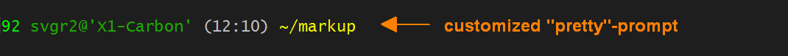
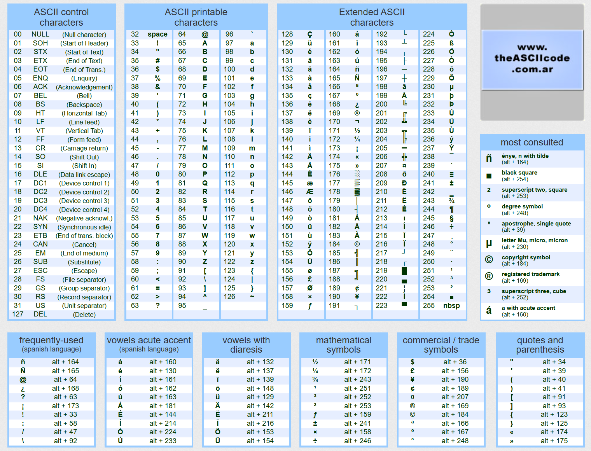
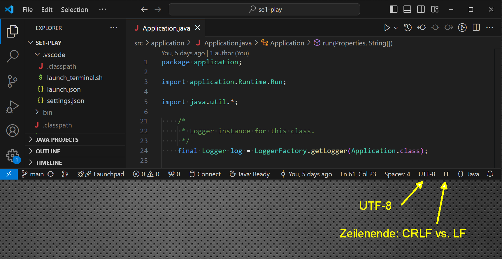
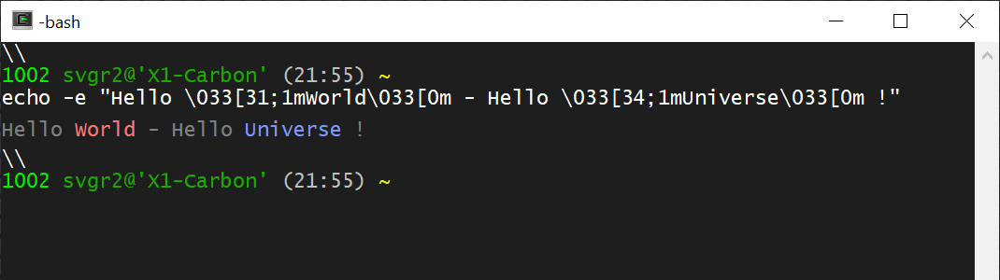
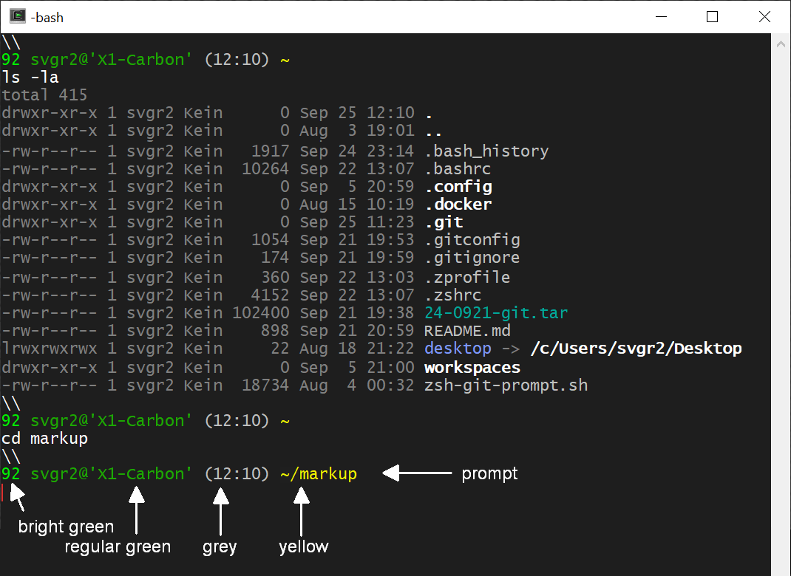
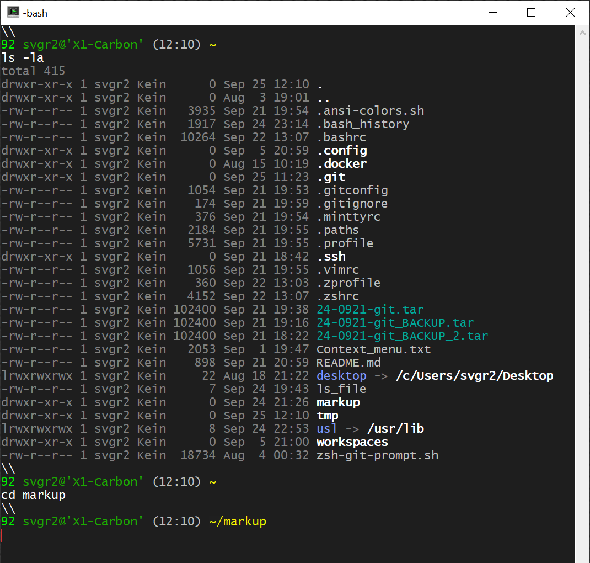
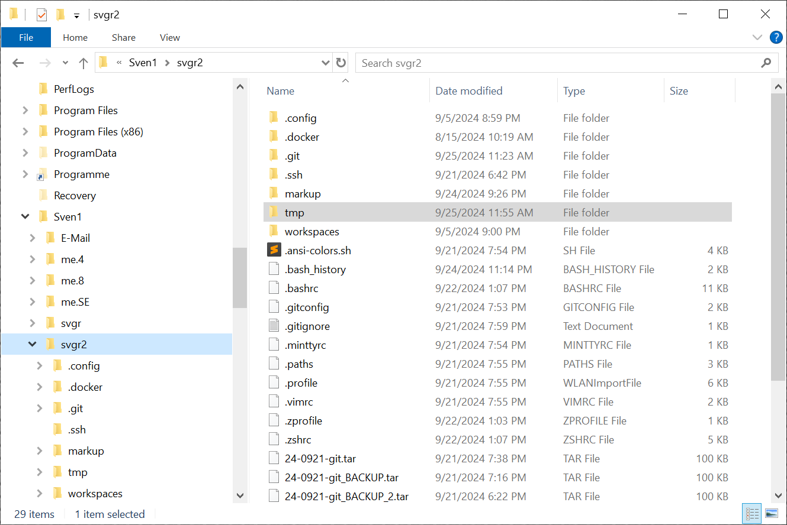
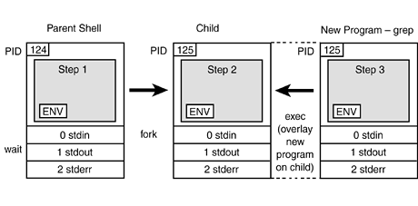
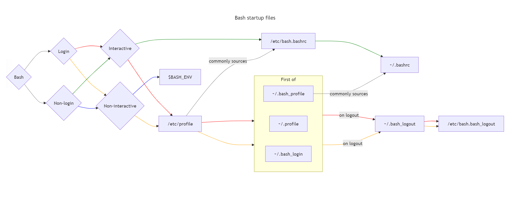
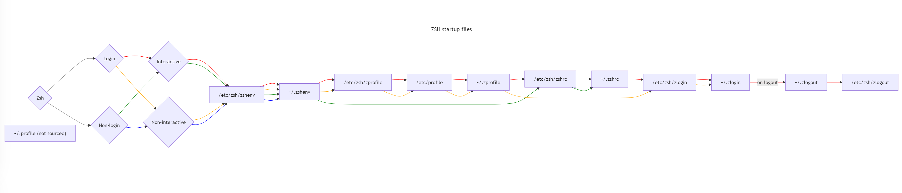

<!-- - - - - - - - - - - - - - - - - - - - - - - - - - - - - - - - - - - - -->
## A2: Understanding the *Terminal*

The terminal is remains a primary tool to interact with computers also in
modern software development. Understanding the terminal and the system
environment remains a key capability.

1. [*Terminal* and *Shell*](#21-terminal-and-shell)

    - What is a (software-) terminal comprised of?

    - Why are terminals relevant today?

    - Understand *ASCII*, *UTF-8* and *ANSI Escape Codes*.

    - Understand the Prompt and *PS1*.

    - What is a *Shell*? Which *Shell* do I use (*bash* or *zsh* (Mac))?

    - Hall of Fame. Who are significant people?


1. [*Filesystem* and *$HOME* directory](#22-filesystem-and-home)

    - What is a *filesystem*?

    - How is a *filesystem* organized (*files, directories, mounts, links*)?

    - What is and where is my *$HOME* directory?

    - What is in my *$HOME* directory?
    
    - What are *dotfiles*?


1. [*Processes* and *Environment Variables*](#23-processes-and-environment)

    - Process creation and inheritance.

    - Global and local *environment variables*.

    - Environment variables: *$HOME*, *$PATH*, *$PS1*.


1. [*Dotfiles*](#24-dotfiles)

    - Role of *profile*, *rc* and *logout* files.

    - Execution order

        - *.profile* (Mac: *.zprofile* ).

        - *.bashrc* (Mac: *.zshrc*).

        - *.bash_logout* (Mac: *.zlogout*).

    - History files.

    - The *source* command and *sourcing* dotfiles.


1. [*Aliases* and *Functions*](#25-aliases-and-functions)

    - What is an *alias*?

    - What is a *shell function*?


&nbsp;
---
### References

- [1] Ray Toal,
    [*Introduction to Bash*](https://cs.lmu.edu/~ray/notes/bash/).

- [2] Seth Kenlon,
    [*Getting started with Zsh*](https://opensource.com/article/19/9/getting-started-zsh),
    (2019).

- [3] Seth Kenlon,
    [*Getting started with Zsh*](https://opensource.com/article/19/9/getting-started-zsh),
    (2019).

- [3] Stanford Seminar: *Computer Systems CS110*,
    [*Lecture 2: Introduction to Filesystems*](https://web.stanford.edu/class/cs110/summer-2021/lecture-notes/lecture-02),
    ([Lecture Notes](https://web.stanford.edu/class/cs110/summer-2021/lecture-notes)), (2021).

- [4] Stanford Seminar: *Computer Systems CS110*,
    [*Lecture 3: Directories and Links*](https://web.stanford.edu/class/cs110/summer-2021/lecture-notes/lecture-03), (2021).

- [5] Stanford Seminar: *Computer Systems CS110*,
    [*Lecture 5: Processes*](https://web.stanford.edu/class/cs110/summer-2021/lecture-notes/lecture-05),
    ([Lecture Notes](https://web.stanford.edu/class/cs110/summer-2021/lecture-notes)), (2021).

- [6] Dionysia Lemonaki:
    [*What are Dotfiles?*](https://www.freecodecamp.org/news/dotfiles-what-is-a-dot-file-and-how-to-create-it-in-mac-and-linux/),
    (2021).

- [7] *A Curated List of Awesome Dotfiles*,
    [[*link*]](https://github.com/webpro/awesome-dotfiles).

- [8] Stackoverflow, *Complete overview of Bash and Zsh startup files sourcing order*, 
    [[*link*]](https://superuser.com/questions/1840395/complete-overview-of-bash-and-zsh-startup-files-sourcing-order)


### Further Reading

- [9] David Farrell: [*An Introduction to Tmux*](https://www.perl.com/article/an-introduction-to-tmux/), (2016).

- [10] Daniel P. Bovet, Marco Cesati: [*Understanding the Linux Kernel*](https://www.amazon.de/-/en/Daniel-P-Bovet/dp/0596002130),
([pdf](https://www.cs.utexas.edu/~rossbach/cs380p/papers/ulk3.pdf)), 3rd Ed., (2006).


---


&nbsp;
---
### Validation

In order to collect points, show notes with answered questions
(on paper or as notes in a text-file):

1. What is a terminal?

1. What is a shell?

1. What is a (Unix-) process?

1. How does the `'|'` - sign work in command lines entered in a terminal?

1. What is the *HOME* - directory?

1. Write down the path to your *HOME* - directory on your laptop.

1. Write down what is in your *HOME* - directory (five entries)?

1. What is *PATH*? What does it do?

1. Where is *PATH* defined? How can it be changed?

1. What are *dotfiles*?

1. Name five *dotfiles* you know and briefly explain their purpose.

1. What is *UTF-8* and why is it not *ASCII*?

1. What is an *ANSI* escape sequence and what is it used for?

1. How can a *pretty-prompt* be created, such as:

    


1. Who is *Ken Thompson*?


<a id="21-terminal-and-shell"></a>

<!-- - - - - - - - - - - - - - - - - - - - - - - - - - - - - - - - - - - - -->
## A2.1: *Terminal* and *Shell*

Topics:

- a) [What is a Terminal?](#a-what-is-a-terminal)

- b) [What is a Software-Terminal?](#b-what-is-a-software-terminal)

- c) [Why are terminals relevant today?](#c-why-are-terminals-relevant-today)

- d) [ASCII, UTF-8 and ANSI Escape Codes](#d-ascii-utf-8-and-ansi-escape-codes)

- e) [What is a *Shell*?](#e-what-is-a-shell)

- f) [Which *Shell* do I use (Mac: *zsh*, other: *bash*)?](#f-which-shell-do-i-use)

- g) [Hall of Fame](#g-hall-of-fame)

<!-- - - - - - - - - - - - - - - - - - - - - - - - - - - - - - - - - - - - -->


---
&nbsp;
### a) What is a Terminal?

A (Software-) Terminal is an application that emulates the behavior of a
hardware terminal comprised of a alphanumiercal screen for text output and
a keyboard for input.

The figure shows a
[*VT100*](https://en.wikipedia.org/wiki/VT100) terminal by *Digital Equipment
Corporation* (DEC, 1978).


The unit is *not a PC*. The unit only contains:

- a *screen* to show alphanumerical output (lines) and

- a *keyboard* to type input (lines).

The terminal must be connected to a separate computer (e.g. a
[*DEC VAX*](https://fedtechmagazine.com/article/2017/07/decs-vax-superminicomputer-became-mainstay-federal-research)).

Interacting with a computer by text-line input and output is the most
basic form of human-machine interaction.


---
&nbsp;
### b) What is a Software-Terminal?

A *Software-Terminal* emulates line-based text input and output
in a window. Terminals can connect to local or remote *machines*,
*virtual machines* and *containers*.

There is a long list of terminal software also known as
[*terminal emulators*](https://en.wikipedia.org/wiki/List_of_terminal_emulators).

- [*mintty*](https://en.wikipedia.org/wiki/Mintty) - terminal emulator used
    by *cygwin*.

- [*putty*](https://www.putty.org) - terminal emulator that allows remote
    login over various protocols, but does not provide a local terminal.

- [*tmux*](https://www.perl.com/article/an-introduction-to-tmux/) is a
    *terminal multiplexer* that can split a larger window into multiple
    terminal panes, each running their own terminal session [3].

*Linux*, *MacOS* have decent terminal software pre-installed (just *"open a
Terminal"*).

Windows does not package decent terminal software. *Cmd.com*, *Powershell.exe*
are incompatible and do not work over the network. Hence, terminal software
must be installed separately for Windows.

Good choices for terminal software for Windows are:

- [*cygwin*](https://www.cygwin.com) - a comprehensive package of Unix-tools
    that emulates a *Unix* environment on Windows (emulator: it appears like
    *Unix*, but runs on *Windows*), including *mintty* terminal emulator.

    To install and setup *cygwin* on *Windows*, follow
    [*instructions*](https://github.com/sgra64/markup/blob/main/setup_cygwin/README.md),
    make sure to switch `/cygdrive/c` to `/c` and select a `$HOME` directory.

- *GitBash* is a restricted *Unix* emulator primarily for *git*. It also includes
    a terminal emulator (`git-bash.exe`). *GitBash* has short-comings over *cygwin*,
    hence *cygwin* should be preferred.


---
&nbsp;
### c) Why are terminals relevant today?

Developers do not only work on their laptops. They ususally connect to other
computers or compute containers over the network through terminal windows,
e.g. through
[*ssh*](https://www.techtarget.com/searchsecurity/definition/Secure-Shell) -
*secure shell* connections.


The terminal is the *universal interface* to those systems such as
[*Virtual Machines (VM)*](https://www.vmware.com/topics/virtual-machine)
or [*Docker Containers*](https://www.docker.com/resources/what-container/)
running on the local system or are running on remote systems such as in a
*Compute Cloud*
([*Amazon EC2*](https://aws.amazon.com/ec2/),
[*Microsoft Azure*](https://azure.microsoft.com/en-us) or
[*Google Cloud*](https://cloud.google.com/) ).

Today, developers work with many terminal windows on their laptops
to interact with local and/or remote machines.

Connectivity to remote computers makes software terminals essential in
modern software development. Hence, developers must understand terminals.


---
&nbsp;
### d) ASCII, UTF-8 and ANSI Escape Codes

Initially, hardware terminals had limited capabilities to display Latin letters,
numbers and symbols such as `.`, `+` or `$`.

[*ASCII*](https://www.ascii-code.com) (American Standard Code for Information
Interchange, 1963) standardized codes using 8 bits. 

Codes `[0 - 31]` are reserved for controlling the terminal, e.g.:
- Code 08 (`0x08`) - `BS` (Backspace)
- Code 13 (`0x0A`) - `CR` (Carriage Return `\r`)
- Code 10 (`0x0A`) - `LF` (Line Feed or newline `\n`)

*Unix* systems (*Linux, Mac, Android,* ...) use `LF` as line ending.
*Windows* uses two characters: `CR` `LF` as line ending causing errors and
confusion when files are exchanged between these two systems (e.g. via a
*git* - repository).

Codes `[31 - 127]` are used for Latin letters, numbers and symbols, e.g.:
- Code 65 (`0x41`) - `A`
- Code 97 (`0x61`) - `a`
- Code 48 (`0x30`) - `0`
- Code 36 (`0x24`) - `$`

Later, characters in the upper 8-bit range: `[128 - 255]` were included,
e.g. for German Umlauts, French accent markers or currency symbols:
- Code 142 (`0x8E`) - `Ä`
- Code 138 (`0x8A`) - `é`
- Code 156 (`0x9C`) - `£`

The [extended ASCII-table](https://theasciicode.com.ar)
([wiki](https://en.wikipedia.org/wiki/Extended_ASCII)) is:



However, only 255 characters can be used with 8 bits and symbols from other
languages (e.g. Chinese) or newer symbols such as the Euro (`€`) cannot be
included.

To overcome the problem, various technologies emerged such as
[ISO/IEC 8859](https://en.wikipedia.org/wiki/ISO/IEC_8859) (1985) to
define several 8-bit coding sets, e.g.
[ISO/IEC_8859-1](https://en.wikipedia.org/wiki/ISO/IEC_8859-1),
[-2](https://en.wikipedia.org/wiki/ISO/IEC_8859-2),
[-3](https://en.wikipedia.org/wiki/ISO/IEC_8859-3), etc.

Supporting terminals could switch between coding sets, but only display
256 symbols of the selected set at a time.

Microsoft introduced its own variety called
`DOS` or [Windows Code Pages](https://en.wikipedia.org/wiki/Windows_code_page)
in 1988, which is still present in Windows today.

Article
[*Character Encoding*](https://faq.computersciencewiki.org/index.php/home/article/character-encoding)
summarizes the current state:
[*UTF-8*](https://en.wikipedia.org/wiki/UTF-8) (*Ken Thompson*, *Rob Pike*, 1992)
is a flexible coding scheme for
[*Unicode*](https://en.wikipedia.org/wiki/Unicode)
that uses 8-bit (UTF-8) for base characters (compatible to ASCII [0 - 127])
and variable `2`, `3` or `4` byte coding for other symbols.

- *2-Byte coding* is used when the lead byte starts with `110`, followed
by a byte starting with `10` leaving (16-3-2) 11 bits or 2048 characters
for 2-byte UTF-8 values.

- *3-Byte coding* is used when the lead byte starts with `1110`, followed
by a byte starting with `10` leaving (24-4-2-2) 16 bits or 65.536 characters
for 3-byte UTF-8 values.

- *4-Byte coding* is used when the lead byte starts with `11110`, followed
by a byte starting with `10` leaving (32-5-2-2-2) 21 bits or 2.097.152 characters
for 4-byte UTF-8 values.

In theory, the scheme can continue to higher byte-values. More detail about
about encodings and character sets can be found in a good article [4].

The [Euro (€)](https://symbl.cc/en/20AC/) symbol is represented in:
- *UTF-8* Encoding: `0xE282AC` - characters use 8 bit.
    - the lead-byte starting with `1110` (`0xE`) means two bytes follow:
        ```sh
             1110 0010 1000 0010 1010 1100      # 0xE2 0x82 0xAC
             ---- 0010 1000 0010 1010 1100      # remove lead code '1110'
             ---- 0010 --00 0010 --10 1100      # remove '10' from folloging bytes
                          0010000010101100      # collect remaining bits
                       0010 0000 1010 1100      # re-byte the remaining bits
                       0x02 0x00 0x0A 0x0C      # bits as hexadecimal numbers
                                  = 0x20AC      # Unicode-value for the '€'-symbol
        11 100 010  10 000 010  10 101 100      # 0xE2 0x82 0xAC as octets
         3   4   2   2   0   2   2   5   4      # octal values: 0342, 0202, 0254
        ```
        - removing leading `10` from bytes leaves:

- *UTF-16* Encoding: `0x20AC` - all characters use 16 bits (no bit manipulation).

- *UTF-32* Encoding: `0x000020AC` - all characters use 32 bits (no bit manipulation).

Most (Software) Terminals support *UTF-8* it, but may need to be put into
that mode, e.g. on Windows by selecting code page 65001 with the *change code page*
command: `chcp.com 65001`

Test `UTF-8` capabilities mode in your terminal:

```sh
echo I\'d pay 10€ to see 10€ here
```

Output:

```
I'd pay 10€ to see 10€ here
```

```sh
echo -e "I won't pay 10\0342\0202\0254 for this"    # print '€' as UTF-8 octets
```

Output:

```
I won't pay 10€ for this
```

IDE such as *VSCode* show the mode they use: `CRLF` or `NL` for line-endings
and: `UTF-8` for character encoding. Make always sure to select `NL` and `UTF-8`
(click the indicators):




&nbsp;

Another topic of terminal configuration is color.
[*ANSI*](https://en.wikipedia.org/wiki/ANSI_escape_code)
is a standard supported by many terminals for displaying color and extended
control functions such as positioning the cursor.

With *ANSI*, so-called *"escape sequences"* starting with the `ESC` character
(octal: `\033`, hexadecimal: `0x1B` or decimal: `27`) followed by a code, e.g.
to select a color: `[31;1` (red) the terminal is switched to that color for the
following characters.

For example, in order to display text in red, escape sequence: `"\033[31;1m"`
is issued before the text (`"World"`), and after the text, the terminal is
reset with escape sequence: `"\033[0m"`:

```sh
echo -e "Hello \033[31;1mWorld\033[0m - Hello \033[34;1mUniverse\033[0m !"
```



&nbsp;

This mechanism is used to color terminal output and also to color the
terminal prompt (`PS1`).



Special environment variable with name `PS1` represents the prompt-string,
which is displayed before each command. Show your prompt string:

```sh
echo $PS1
```

Prompts can be largely
[*customized*](https://wiki.archlinux.org/title/Bash/Prompt_customization)
by setting `PS1`, e.g. with the help
of a [*prompt-generator*](https://bash-prompt-generator.org/) or with
prompt libraries such as
[*Oh My ZSH!*](https://ohmyz.sh/) (for Mac).


---
&nbsp;
### e) What is a *Shell*?

A ["*Shell*"](https://www.datacamp.com/blog/what-is-shell) is a process
the reads input from `stdin` (e.g. a keyboard connected to the terminal),
interprets this input as a *shell command*, executes the command or forks a
process that executes the command and outputs results to `stdout` or `stderr`
channels that, if connected to a terminal, are displayed at the terminal.

Examples of shell commands are:

```sh
cd $HOME            # change directory (cd) to the $HOME directory

pwd                 # print the current working directory (pwd)

ls -la              # list (ls) the content of current directory (-a: all files,
                    # including dotfiles, -l: long format)
```

Output:

```
pwd
/c/Sven1/svgr2

ls -la
total 415
drwxr-xr-x 1 svgr2 Kein      0 Sep 24 19:20 .
drwxr-xr-x 1 svgr2 Kein      0 Aug  3 19:01 ..
-rw-r--r-- 1 svgr2 Kein   3935 Sep 21 19:54 .ansi-colors.sh
-rw-r--r-- 1 svgr2 Kein    343 Sep 22 22:04 .bash_history
-rw-r--r-- 1 svgr2 Kein  10264 Sep 22 13:07 .bashrc
drwxr-xr-x 1 svgr2 Kein      0 Sep  5 20:59 .config
drwxr-xr-x 1 svgr2 Kein      0 Aug 15 10:19 .docker
drwxr-xr-x 1 svgr2 Kein      0 Sep 24 17:43 .git
-rw-r--r-- 1 svgr2 Kein   1054 Sep 21 19:53 .gitconfig
-rw-r--r-- 1 svgr2 Kein    174 Sep 21 19:59 .gitignore
-rw-r--r-- 1 svgr2 Kein    376 Sep 21 19:54 .minttyrc
-rw-r--r-- 1 svgr2 Kein   2184 Sep 21 19:55 .paths
-rw-r--r-- 1 svgr2 Kein   5731 Sep 21 19:55 .profile
drwxr-xr-x 1 svgr2 Kein      0 Sep 21 18:42 .ssh
-rw-r--r-- 1 svgr2 Kein   1056 Sep 21 19:55 .vimrc
-rw-r--r-- 1 svgr2 Kein    360 Sep 22 13:03 .zprofile
-rw-r--r-- 1 svgr2 Kein   4152 Sep 22 13:07 .zshrc
-rw-r--r-- 1 svgr2 Kein 102400 Sep 21 19:38 24-0921-git.tar
-rw-r--r-- 1 svgr2 Kein 102400 Sep 21 19:16 24-0921-git_BACKUP.tar
-rw-r--r-- 1 svgr2 Kein    898 Sep 21 20:59 README.md
lrwxrwxrwx 1 svgr2 Kein     22 Aug 18 21:22 desktop -> /c/Users/svgr2/Desktop
drwxr-xr-x 1 svgr2 Kein      0 Sep 24 17:48 markup
drwxr-xr-x 1 svgr2 Kein      0 Aug 17 14:12 se1-bestellsystem
drwxr-xr-x 1 svgr2 Kein      0 Sep 24 19:20 tmp
drwxr-xr-x 1 svgr2 Kein      0 Sep  5 21:00 workspaces
```

A *shell* process has no information to which input (`stdin`) or output
channels (`stdout`, `stderr`) it is connected to. Therefore, input can
also come from a (script) file or output can be written to files using
input `<` and output redirect `>`.

```sh
echo "ls -la" > ls_file     # write string: "ls -la" to file named "ls_file"
sh < ls_file                # shell reads command from the file and executes it
```

A [*"Pipe"*](https://www.geeksforgeeks.org/piping-in-unix-or-linux) ( `|` )
connects two processes with `stdout` of the first process to `stdin`
of the second process such that the second process receives the output
of the first process as input.

In the example below, the (parent-) *shell* process *creates the pipe*,
then *"forks"* two child-processes and connects their `stdin` and `stdout`
channels to the pipe.

```sh
# The shell process creates the pipe in the operating system, then forks two
# child-processes and wires their 'stdout' and 'stdin' channels to the pipe.
# 
# The first process executes "ls -la" directing output into the pipe from
# which the second process (grep) reads and filters lines that match regular
# expression: ' \.[a-z].*'

ls -la $HOME | grep ' \.[a-z].*'
```

The first process (`ls -la $HOME`) produces a listing of lines of all
files and directories of `$HOME`. It is not aware that output is connected
to a pipe feeding it into the second process (`grep ' \.[a-z].*'`), which
filters lines by the regular expression (filenames that match a space,
followed by a dot, followed by any lower-case letter sequence).

The resulting output shows only the *dotfiles* in the *$HOME* directory
(compare to the full listing above):

```
-rw-r--r-- 1 svgr2 Kein    343 Sep 22 22:04 .bash_history
-rw-r--r-- 1 svgr2 Kein  10264 Sep 22 13:07 .bashrc
drwxr-xr-x 1 svgr2 Kein      0 Sep  5 20:59 .config
drwxr-xr-x 1 svgr2 Kein      0 Aug 15 10:19 .docker
drwxr-xr-x 1 svgr2 Kein      0 Sep 24 17:43 .git
-rw-r--r-- 1 svgr2 Kein   1054 Sep 21 19:53 .gitconfig
-rw-r--r-- 1 svgr2 Kein    174 Sep 21 19:59 .gitignore
-rw-r--r-- 1 svgr2 Kein    376 Sep 21 19:54 .minttyrc
-rw-r--r-- 1 svgr2 Kein   5731 Sep 21 19:55 .profile
drwxr-xr-x 1 svgr2 Kein      0 Sep 21 18:42 .ssh
-rw-r--r-- 1 svgr2 Kein   1056 Sep 21 19:55 .vimrc
-rw-r--r-- 1 svgr2 Kein    360 Sep 22 13:03 .zprofile
-rw-r--r-- 1 svgr2 Kein   4152 Sep 22 13:07 .zshrc
```

A *terminal* process connects keyboard input to `stdin` for a *shell* process
and displays output received from *shell's* `stdout` and `stderr`.

A *terminal* therefore always has at least two processes: the process that
emulates the terminal and a *shell* process that connects to the terminal.
The *shell* process interprets commands it receives from its `stdin` channel,
which is connected to the `stdout`-channel of the terminal-process. The
`stdin` channel of the terminal-process is connected to the keyboard.
The same path exists for output commands produce.

Question: How many processes are involved with following commands typed into
a terminal?

Example 1:

```sh
# compile file 'HelloWorld.java' with the javac compiler to file 'HelloWorld.class'
javac HelloWorld.java
```

Answer:

- process 1: *terminal* software, e.g. `/usr/bin/mintty.exe`

- process 2: *shell* process, e.g. `/usr/bin/bash.exe`

- process 3: process that executes the Java compiler (that process was *"forked"*
    by the *shell* process), here the Java Compiler:
    `/c/Program Files/Java/jdk-21/bin/javac.exe`

Example 2:

```sh
ls -la $HOME | grep ' \.[a-z].*'
```

- process 1: *terminal* software, e.g. `/usr/bin/mintty.exe`

- process 2: *shell* process, e.g. `/usr/bin/bash.exe`

- process 3: process that executes the `ls -la` command (forked by *shell* process)

- process 4: process that executes the `grep` command (also forked by *shell* process)

The *shell* process creates the pipe for this command, connects `stdout`
of process 3 and `stdin` of process 4 to the pipe.

*Shell* processes can fork more child-processes depending on commands.


---
&nbsp;
### f) Which *Shell* do I use?

Many *shells* have emerged over the years, starting with the initial
*Bourne Shell: sh* (after its creator:
[*Stephen Bourne*](https://en.wikipedia.org/wiki/Stephen_R._Bourne),
1978).


Other shells are:
*C-Shell: csh* ([*Bill Joy*](https://en.wikipedia.org/wiki/Bill_Joy), 1970 at UCB),
*Korn-Shell: ksh* ([*Dave Korn*](https://en.wikipedia.org/wiki/David_Korn_(computer_scientist)), 1980) and
*Z-Shell: zsh* (Paul Falstad, 1990).

[*Brian Fox*](https://en.wikipedia.org/wiki/Brian_Fox_(programmer))
re-implemented Bourne Shell in 1989 calling it *Bourne-Again Shell: bash*.
<!-- 

 -->


Today, popular choices for *shells* are:
[*bash*](https://cs.lmu.edu/~ray/notes/bash) [1]
that is pre-installed on most *Unix* and *Linux* systems and also available
for Unix-emulators such as *cygwin*.

*Mac* have
[*zsh*](https://opensource.com/article/19/9/getting-started-zsh) [2]
pre-installed that differs to other shells in some details.


---
&nbsp;
### g) Hall-of-Fame

The Unix Operating system is the most influencial technical innovation
in the field of software systems in the second half of the 20th century.

All operating systems today incorporate the basic concepts developed in Unix:

- A *Kernel* that is protected from applications.

- Applications execute as *processes* in isolation from one another.

- Persistent data is organized as *files* stored in a *hierarchical filesystem*
    on an external storage medium (hard drives, SSD).

- Inter-Process Communication (IPC) allows processes to exchange data through
    *Pipes*. *Sockets* extend the concept to networks.

Most computers today run a Unix-based operating system, including *Linux*,
*Android*, *iOS*, *MacOS* as well as most containers (*Docker*).
Linux is the dominant operating system in the Cloud.

In the 1960s-1970s, *Ken Thompson* invented the UNIX operating system with
*Dennis Ritchie* at *AT&T Bell Labs*.
They also worked on a programming language called *B*, which *Dennis Ritchie* and
*Bryan Kernighan* evolved to the programming language *C*, which is still used
to implement the Linux Kernel.
*Ken Thompson* and *Rob Pike* worked on an operating system Plan 9, which
introduced new concepts such as the layered filessystem. At Google, they worked
on the programming language *Go* (Google, 2009).

For their contributions, *Ken Thompson* and *Dennis Ritchie* received the
[Turing Award](https://amturing.acm.org/byyear.cfm) in 1983.

 [Ken Thompson](https://en.wikipedia.org/wiki/Ken_Thompson) (*1943)

 [Dennis Ritchie](https://en.wikipedia.org/wiki/Dennis_Ritchie) (1941-2011)

 [Brian Kernighan](https://en.wikipedia.org/wiki/Brian_Kernighan) (*1942)

 [Rob Pike](https://en.wikipedia.org/wiki/Rob_Pike) (*1956)

 [Linux Torvalds](https://en.wikipedia.org/wiki/Linus_Torvalds) (*1969)


2019: [*50 Years of Unix*](https://www.bell-labs.com/about/history/innovation-stories/50-years-unix), Celebration, AT&T Bell Labs (now Nokia Labs), also known for the
[Unix Puzzle](https://www.unixgame.io/unix50).

2019: *Ken Thompson interviewed by Brian Kernighan at VCF East 2019*,
[Youtube](https://www.youtube.com/watch?v=EY6q5dv_B-o) video (1:03:50).


&nbsp;
---
### References

- [1] Ray Toal,
    [*Introduction to Bash*](https://cs.lmu.edu/~ray/notes/bash/).

- [2] Seth Kenlon,
    [*Getting started with Zsh*](https://opensource.com/article/19/9/getting-started-zsh),
    (2019).

- [3] David Farrell: [*An Introduction to Tmux*](https://www.perl.com/article/an-introduction-to-tmux/), (2016).

- [4] David C. Zentgraf: [*What every Programmer needs to know about Encodings and Character Sets*](https://kunststube.net/encoding/), (2015).


&nbsp;
---


<a id="22-filesystem-and-home"></a>

<!-- - - - - - - - - - - - - - - - - - - - - - - - - - - - - - - - - - - - -->
## A2.2: *Filesystem* and *$HOME* directory

Topics:

- a) [What is a *filesystem*?](#a-what-is-a-filesystem)

- b) [How is a *filesystem* organized (*files, directories, mounts, links*)?](#b-how-is-a-filesystem-organized)

- c) [What is and where is my *$HOME* directory?](#c-what-is-and-where-is-my-home-directory)

- d) [What is in my *$HOME* directory (*dotfiles*)?](#d-what-is-in-my-home-directory)

<!-- - - - - - - - - - - - - - - - - - - - - - - - - - - - - - - - - - - - -->


---
&nbsp;

Built-in computer memory (RAM) does not preserve data over power cycles.
Hence, there is a need to permanently store data on external storage.

External storage traditionally has been magnetic with setting north/south
orientiation of magnetic particles that was preserved in particles.
Magnetic particles were put on movable carriers (tape, drums or disks)
such that a particle could be positioned under a read/write head.


Today, [Solid-State (SSD)](https://en.wikipedia.org/wiki/Solid-state_drive)
technology is used that no longer requires moving parts and uses electric
charges in MOSFET
[Floating Gate Transistor](https://www.embedded.com/flash-101-types-of-nand-flash)
to presever information.

Example of a modern 1TB SSD:


However, the underlying interfaces (SATA, SAS) assuming a linear *block structure*
remain unchanged although SSD-memory is directly accessible (modern interfaces
take this into account, e.g. *SATA.2, NVMe*).


---
&nbsp;
### a) What is a *filesystem*?

The smallest unit written to external storage is a *block* of 4k, 8K or 16k
bytes. An external medium is seen as a sequence of *blocks*: 1 .. n.

Assuming 8k block size, a 1TB "hard drive" contains 134,217,728 blocks of 8k byte
size. Files smaller than 8k fit in 1 block. Larger files require more blocks.

A [filesystem](https://www.geeksforgeeks.org/file-systems-in-operating-system)
is software (part of the operating system) and data structures that keep track
of the relation between files and blocks of the underlying storage medium.

The data structure describing these relations itself must be persistent and
therefore also be represented on the underlying storage medium. Certain blocks
are therefore occupied by the filesystem itself.

Furthermore, people assume files to be named. Therefore, the filesystem also
manages organizational (directories) and desciptive data (meta-data) for files
that include names (in directories) and times of creation, last modification,
the actual file size, access rights, etc. in the file's meta-data (*i-node*),
which also includes the linkage to blocks or the starting block.

Filesystems differ in how relations between file meta-data and blocks are
organized. For example, Windows *FAT* (File Allocation Table) uses a linked
list of blocks that comprise a file. Most modern filesystems use variations
of tree structures to allow for faster access time.


---
&nbsp;
### b) How is a *filesystem* organized?

Since the amount of files is large, people furthermore an organizational
structure that allows them to group files. For this, hierarchical
*directories* were introduced in most filesystems.

A *directory* (or *folder*) contains a list of names representing files
"that reside in that folder".

Folders may contain other folders creating a hierarchical structure that starts
with a *root directory*: `[ / ]`.


&nbsp;

A *path* describes a path through the hierarchy from one folder to another.

An *absolute path* always starts at the *root directory*: `[ / ]`.

A *relative path* starts at the *current* or *working directory*.
Special names `[ . ]` and `[ .. ]` refer to the *current* or *parent directory*.

While the *root directory*: `[ / ]` is the same for all processes, the
*current* or *working directory* is specific for a process and can be
changed for each process.

For a *shell* process, command `cd` (change directory) is used.

Command `pwd` (*print working directory*) shows the current *working directory*.

```sh
cd /usr/bin         # change the current directory to '/usr/bin' (abs. path)
pwd                 # pwd: print working directory
/usr/bin

cd ..               # cd one level up -> /usr
cd lib              # cd from current directory: /usr one level down into /usr/lib
cd ../../etc        # cd from /usr/lib two levels up (-> '/') and into /etc
cd /etc             # does the same with absolute path: /etc
```

*Links* are names in directories associated with a path pointing to another
file or directory. The path is stored in a file and therefore permanent
(called a *"symbolic link"*).

Links can be created with the `ln` command and removed
with the `rm` command.

```sh
cd                      # change to the HOME directory
ln -s /usr/lib usl      # create symbolic -s link with name 'usl' in current
                        # directory pointing to directory: /usr/lib

ls -la usl              # show new link in current directory
lrwxrwxrwx 1 8 Sep 24 22:53 usl -> /usr/lib/

cd usl                  # cd follows link and changes to /usr/lib
```

*Mounts* allow to connect (*"mount"*) filesystems, e.g. from different external
media. One filesystem's root directory is attached to a directory of another
filesystem. That directory is called *"mount point"*. Content of this directory
is then overlayed with the content of the *root* directory of the mounted
file system.

Mounts are initiatiated with the `mount` command and `umount` to un-mount.
Mounts can be assoiated with permission and access rights. For example, a
filesystem can be mounted *"read-only"* with files underneath the mount point
cannot be altered.

Paths and commands can cross mount points and reach into any directory (assuming
permissions).

```sh
cat /etc/mtab           # show currently mounted filesystems
C:/opt/cygwin64/bin /usr/bin ntfs binary,auto 1 1
C:/opt/cygwin64/lib /usr/lib ntfs binary,auto 1 1
C:/opt/cygwin64 / ntfs binary,auto 1 1
C: /c ntfs binary,noacl,posix=0,user,noumount,auto 1 1
```


---
&nbsp;
### b) What is and where is my *$HOME* directory?

The *$HOME* directory is a directory associated with every user on a system.
It usually has the name of the user, e.g. `meyer` for user Meyer and is located
in the `users` directory.

*HOME* is the name of an environment variable that contains the absolute path
to a user's home directory.

After login or opening a terminal, a *shell* process starts in the
*$HOME* directory.

```sh
cd                  # cd with no argument changes to the $HOME directory
pwd                 # print working directory (which is $HOME after 'cd')
/c/Sven1/svgr2      # output shows the absolute path to the $HOME directory

# print line with value ($) of HOME variable -> $HOME
echo "home directory: $HOME"
home directory: /c/Sven1/svgr2
```

Open a terminal and print the value of the $HOME variable.

Open `explorer` (Windows), `finder` (Mac) or a *file manager* (Linux) and
navigate to your $HOME directory.

The `Explorer`/`Finder` content of the $HOME directory should show the same
content as in the terminal with: `ls -la`

<table>
<td valign="top">

<td valign="top">

</table>

`Windows/cygwin`: after installation, $HOME directories start in the cygwin
installation folder, e.g.: `C:/Program Files/cygwin64/home/svgr2`.
Follow [instructions]() to relocate the $HOME directory.


---
&nbsp;
### c) What is in my *$HOME* directory?

The *$HOME* directory is the place where applications store user-specific
configuration information in files or directories that often start with a
dot `[.]` making then *"hidden"* in the *$HOME* directory.

In order to see them, those *"hidden files"* must be made visible.
Follow instructions to show hidden files
[on Windows](https://www.howtogeek.com/446/show-hidden-files-and-folders-in-windows/) or
[on Mac](https://www.avast.com/c-mac-show-hidden-files).

Dotfiles are regular text files and dot-directories are regular directories.

Show which hidden files already exist in the $HOME directory:

```sh
cd                  # change to $HOME directory
ls -la -d .*        # list dotfiles starting with .*
```

Output shows dotfiles and dot-directories (may vary):

```
   -rw-r--r-- 1 svgr2 Kein  1917 Sep 24 23:14 .bash_history
   -rw-r--r-- 1 svgr2 Kein 10264 Sep 22 13:07 .bashrc
-> drwxr-xr-x 1 svgr2 Kein     0 Sep  5 20:59 .config      <-- .dot directory
-> drwxr-xr-x 1 svgr2 Kein     0 Aug 15 10:19 .docker      <-- .dot directory
-> drwxr-xr-x 1 svgr2 Kein     0 Sep 25 11:23 .git         <-- .dot directory
   -rw-r--r-- 1 svgr2 Kein  1054 Sep 21 19:53 .gitconfig
   -rw-r--r-- 1 svgr2 Kein   174 Sep 21 19:59 .gitignore
   -rw-r--r-- 1 svgr2 Kein   376 Sep 21 19:54 .minttyrc
   -rw-r--r-- 1 svgr2 Kein  5731 Sep 21 19:55 .profile
-> drwxr-xr-x 1 svgr2 Kein     0 Sep 21 18:42 .ssh         <-- .dot directory
   -rw-r--r-- 1 svgr2 Kein  1056 Sep 21 19:55 .vimrc
   -rw-r--r-- 1 svgr2 Kein   360 Sep 22 13:03 .zprofile
   -rw-r--r-- 1 svgr2 Kein  4152 Sep 22 13:07 .zshrc
```

Important dotfiles (dot-directories) are:

- `.profile`: contains *bash* commands that are executed once when a new
    terminal is opened.

- `.bashrc`: contains *bash* commands executed every time a new *bash shell*
    is started.

  - Mac uses *zsh* with `.zprofile` and `.zshrc` dotfiles.

- `.gitconfig`: user-specific *git* configurations that apply to all
    user's git projects.

- `.ssh`: dot-directory that contains public and private key pairs for
    remote authentication (e.g. at *GitHub*, *GitLab* repositories or in
    cloud accounts).

- `vimrc`: user's configuration for the *vim* text editor.

- `.minttyrc`: user's configuration for the *mintty* terminal emulator.

- `.docker`: dot-directory that contains user-specific configuration information
    for *Docker*.

Dotfiles are text files. In order to change them, a decent text editor should be
installed on the laptop such as:

- [sublime](https://www.sublimetext.com) or

- `vim`, [tutorial](https://opensource.com/article/19/3/getting-started-vim).

See [section 4 ](#24-dotfiles) for specifically setting up the environment.


&nbsp;
---
### References

- [1] Stanford Seminar: *Computer Systems CS110*,
    [*Lecture 2: Introduction to Filesystems*](https://web.stanford.edu/class/cs110/summer-2021/lecture-notes/lecture-02),
    ([Lecture Notes](https://web.stanford.edu/class/cs110/summer-2021/lecture-notes)), (2021).

- [2] Stanford Seminar: *Computer Systems CS110*,
    [*Lecture 3: Directories and Links*](https://web.stanford.edu/class/cs110/summer-2021/lecture-notes/lecture-03), (2021).

- [3] Dionysia Lemonaki:
    [*What are Dotfiles?*](https://www.freecodecamp.org/news/dotfiles-what-is-a-dot-file-and-how-to-create-it-in-mac-and-linux/),
    (2021).

---
&nbsp;


<a id="23-processes-and-environment"></a>

<!-- - - - - - - - - - - - - - - - - - - - - - - - - - - - - - - - - - - - -->
## A2.3: *Processes* and *Environment Variables*

Topics:

- a) [Process creation and inheritance](#a-process-creation-and-inheritance)

- b) [Global and local *environment variables*](#b-global-and-local-environment-variables)

- c) [Variables: *$HOME*, *$PATH*](#c-variables-home-path)

<!-- - - - - - - - - - - - - - - - - - - - - - - - - - - - - - - - - - - - -->


---
&nbsp;
### a) Process creation and inheritance

In a Unix-type system (and in Windows) all(!) programs are executed as
*processes*.

A *process* is created by the operating system as a unit of execution
comprised of:

- a program (an executable file, e.g. `/usr/bin/bash.exe`),

- process-specific data: *static data, heap data, call stack*,

- an *environment* with environment variables, e.g. `PATH` separated in:

  - *local variables* that are present for the executing process and

  - so-called *global variables* that are present for the executing process and
    that are passed to *child processes*.

- connectors for input and output: `stdin`, `stdout`, `stderr` that can be
    connected

    - to a terminal (keyboard: `stdin`, screen: `stdout`, `stderr`),

    - to files using input- output-redirect ( `>`, `<` ) or can be connected

    - to other processes through *pipes* ( `|` ):

Examples:
```sh
echo "class HelloWorld { }" > HelloWorld.java   # output redirect to file '>'

cat HelloWorld.java | wc                        # connect processes via pipe '|'
```

In the examples, processes executing programs (`echo`, `cat`, `wc`) are
created by the *shell* process receiving commands.

The *shell* process passes its global environment variables on to all
created *child processes* - or: *Child processes* inherit global variables
from their *parent process*.

A new process is created when a (parent-) calls `fork()`, which is system call
that is handled in the operating system kernel.
The operating system creates a new process instance (new `process-ID`) and
duplicates the parent process (code, data, environment variables).

The parent-process then *"executes twice"*. In the "*child*"-part, the program
gets then usually replaced by a new program using the `exec(prog, args)` function:

```c
#include <stdio.h>
#include <sys/wait.h>
#include <unistd.h>

int main(int argc, char **argv) {
    printf("parent: %ld\n", (long) getpid());
    // 
    // fork() duplicates the parent process and returns 0 for parent and
    // the process id (pid) >0 for the new child process
    pid_t p = fork();
    if(p) {
        // parent part: wait for the child to return/exit
        printf("parent: %ld, child: %ld\n", (long) getpid(), (long) p);
        pid_t p2 = wait(&(int) {0});
        printf("parent: p==p2? %d\n", p==p2);
    } else {
        // child part: replace parent program with program to execute:
        // 'grep source .bashrc'
        printf("child: %ld\n", getpid());
        return exec("/usr/bin/grep", "grep", "source", ".bashrc", NULL);
    }
}
```

The figure below shows the steps of creating a child-process:

- step 1: parent process issues `fork()` system call.

- step 2: operating system duplicates parent process. `fork()` returns
    `process-id > 0` to initiating parent process and `process-id==0`
    to new child process.

- step 3: child-process replaces code with the program to actually
    execute using `exec()`.

Other properties of the parent process (e.g. global environment variables)
remain unchanged.


<!-- 

-->


---
&nbsp;
### b) Global and local *environment variables*

Environment variables can be shown and defined by *shell* commands. A dollar
sign (`$`) must be used to refer to the value of the variable:

```sh
echo $NEW_VAR               # show content ('$') of variable NEW_VAR
                            # content is empty (undefined)

NEW_VAR="a new variable"    # define variable NEW_VAR

echo $NEW_VAR               # show content again
a new variable              # now content is present

unset NEW_VAR               # remove variable
echo $NEW_VAR               # show content
                            # content is again empty (undefined)
```

Variable `NEW_VAR` was defined only for the *shell* process that executed
commands.

In order to pass the variable to child processes of *shell*, the variable
must be *"exported"*.

```sh
NEW_VAR="a new variable"    # define variable NEW_VAR
export NEW_VAR              # turn variable in global variable

export NEW_VAR="a new variable"         # combine both
```

When a new terminal is opened from this *shell*, all global variables
are passed on to the new terminal and *shell* processes:

```sh
mintty                      # create new terminal process (opens new terminal)
```

The *shell* process in the new terminal has the variable:

```sh
echo $NEW_VAR
a new variable
```

When a new terminal is opened through an icon or a contect menu
(not through the *shell* above), the variable is not present:

```sh
echo $NEW_VAR               # empty, undefined
```


---
&nbsp;
### c) Variables: *$HOME*, *$PATH*

The `env` or `declare -p` or `compgen -e` (bash) commands lists environment
variables.
<!-- 
show global (exported) variables:
- bash: compgen -e
- zsh: set -o extendedglob; print -roC1 -- ${(k)parameters[(R)^*export*]}
-->

*$HOME* always points to the user's home directory and can be used in commands,
e.g.: `cd $HOME`.

*$PATH* is a global environment variable of a list of directories in which
*shell* searches for executable commands when they are not specified with a path.

For example:

```sh
/usr/bin/grep.exe source .bashrc        # call 'grep' command with full path
```

Calling `grep` without path, requires its path `/usr/bin` to be included in the
*$PATH* variable. *Shell* then searches *$PATH* and executes the first
matching path/command.

If the path for the command was not on *$PATH*, an error: `command not found` is
issued.

```sh
echo $PATH          # show content of PATH variable
.:/usr/local/bin:/usr/bin:/bin:/c/WINDOWS:/c/WINDOWS/system32:/c/WINDOWS/System32/WindowsPowerShell/v1.0:/c/Program Files (x86)/Git/cmd:/c/Users/svgr2/AppData/Local/Programs/Microsoft VS Code/bin:/c/Program Files/Java/jdk-21/bin:/c/opt/maven/bin:/c/Users/svgr2/AppData/Local/Programs/Python/Python312:/c/Users/svgr2/AppData/Local/Programs/Python/Python312/Scripts:/c/Program Files/Docker/Docker/resources/bin
```

Replacing the seperator sign `:` with newline `\n`:

```sh
echo $PATH | tr ':' '\n'
```
exposes the structure of the *$PATH* variable:
```
.                   <-- programs in the current directory (.) are found first
/usr/local/bin
/usr/bin            <-- allows commands like `vi`, `grep` rather than with
/bin                    full path: `/usr/bin/grep`, `/usr/bin/vi`
/c/WINDOWS
/c/WINDOWS/system32
/c/WINDOWS/System32/WindowsPowerShell/v1.0
/c/Program Files (x86)/Git/cmd
/c/Users/svgr2/AppData/Local/Programs/Microsoft VS Code/bin
/c/Program Files/Java/jdk-21/bin        <-- find `java`, `javac`, `jar`, etc.
/c/opt/maven/bin                        <-- find command 'mvn'
/c/Users/svgr2/AppData/Local/Programs/Python/Python312      <-- find `python`
/c/Users/svgr2/AppData/Local/Programs/Python/Python312/Scripts
/c/Program Files/Docker/Docker/resources/bin
```

The *$PATH* variable must be set such that it is inherited to all processes,
typically in *shell* rc-files: `.bashrc` or `.zshrc` (Mac).


&nbsp;
---
### References

- [1] Stanford Seminar: *Computer Systems CS110*,
    [*Lecture 5: Processes*](https://web.stanford.edu/class/cs110/summer-2021/lecture-notes/lecture-05),
    ([Lecture Notes](https://web.stanford.edu/class/cs110/summer-2021/lecture-notes)), (2021).

---
&nbsp;


<a id="24-dotfiles"></a>

<!-- - - - - - - - - - - - - - - - - - - - - - - - - - - - - - - - - - - - -->
## A2.4: *Dotfiles*

Topics:

- a) [What are *Dotfiles*?](#a-what-are-dotfiles)

- b) [Role of *profile*, *rc* and *logout* files](#b-role-of-profile-rc-and-logout-files)

- c) [Execution order](#c-execution-order)

- d) [History files](#d-history-files)

- e) [*Sourcing* dotfiles](#e-sourcing-dotfiles)

<!-- - - - - - - - - - - - - - - - - - - - - - - - - - - - - - - - - - - - -->


---
&nbsp;
### a) What are *Dotfiles*?

"Dotfiles" are files (or directories with files) with names that start
with a dot `[.]`. They contain vital setup and configuration information
for the system and for tools. Most dotfiles are stored in the user's
`$HOME` directory.

On most systems, dotfiles are "hidden" (not visible) in the filesystem by default. To show them, follow instructions for Mac or Windows.


---
&nbsp;
### b) Role of *profile*, *rc* and *logout* files

Prominent dotfiles are *.profile*, *.zprofile* (Mac) in a User's `$HOME`
directory that automatically run *on Login* (or a new terminal is opened)
and *.bashrc*, *.zshrc* (Mac) that run when a *new shell process starts*.

*"Profile"* scripts run upon startup, login, when a new terminal is opened
or after login in a remote system (a remote machine or local or remote
virtual machines or containers).

*"Profile"* perform tasks that last for the entire session and can be
inhertited (*"exported"*) to sub-processes (e.g. *shells*).

*"rc-files"* execute evertime a new *shells* starts and their impact
should is valid for the existence of the *shell* process only and
can be exported to sub-processes of the *shell* process.

*"logout"* execute when a session (a terminal) is closed.


---
&nbsp;
### c) Execution order

Before *profile* and *rc-files* from the User's `$HOME` directory, system-wide
files execute that are hosted in the `/etc` (pronounce: *et'see*) directory.

```
/etc/profile
```

Exact execution order of *profile*, *rc-* and *logout-* files varies for *shells*.

The chart shows the full execution path for *bash* (source: [3]):



This chart shows the execution path for *zsh* (Mac) (source: [3]):



More detail can be found in [3].


---
&nbsp;
### d) History files

*History-files*, e.g. `.bash_history` store typed commands as a conseutive list.
They can be recalled by the `history` command to avoid double typing.

*History-files* are also stored in the User's `$HOME` directory. They are
automatically created by *Shells*.

Prompts usually indicate the command number under which a file is stored in the
*history-file*.


---
&nbsp;
### e) *Sourcing* dotfiles

*"Sourcing"* dotfiles (or any script) refers to the *Shell* command:
[*source*](https://linuxcommand.org/lc3_man_pages/sourceh.html).

```sh
$ source ~/.bashrc          # sourcing the .bashrc file executes commands by the
                            # same shell process.
```

Commands from the script are executed *within* the context of the same
*Shell* and are therefore effective for this *Shell* making changes
to environment variables, e.g. `export PATH+=":/bin/java/jdk-21/bin"`
effective for the terminal *Shell*.

In contrast, for *script execution* (without `source`), the terminal *Shell*
will create a sub-process (a *child-Shell* process) execute the script.
Changes to the environment (e.g. to `$PATH`) will be effecitve in the
*child-process* only and *not propagate back* to the parent *Shell* in
the terminal.

```sh
$ cleanup.sh                # commands of the 'cleanup,.sh' script are executed
                            # by a sub-process (child-shell)
```


&nbsp;
---
### References

- [1] Dionysia Lemonaki:
    [*What are Dotfiles?*](https://www.freecodecamp.org/news/dotfiles-what-is-a-dot-file-and-how-to-create-it-in-mac-and-linux/),
    (2021).

- [2] *A Curated List of Awesome Dotfiles*,
    [[*link*]](https://github.com/webpro/awesome-dotfiles).

- [3] Stackoverflow, *Complete overview of Bash and Zsh startup files sourcing order*, 
    [[*link*]](https://superuser.com/questions/1840395/complete-overview-of-bash-and-zsh-startup-files-sourcing-order)

---
&nbsp;


<a id="25-aliases-and-functions"></a>

<!-- - - - - - - - - - - - - - - - - - - - - - - - - - - - - - - - - - - - -->
## A2.5: *Aliases* and *Functions*

Topics:

- a) [What is an *alias*?](#a-what-is-an-alias)

- b) [What is a *shell function*?](#b-what-is-a-shell-function)

<!-- - - - - - - - - - - - - - - - - - - - - - - - - - - - - - - - - - - - -->


---
&nbsp;
### a) What is an *alias*?

*Aliases* are short-cuts for user-defined *Shell* commands that
simplify typing. *Aliases* are usually defined in
*.bashrc* / *.zshrc* files.

*Aliases* are not inherited to sub-processes and hence definitions
must be loaded every time a *Shell* process starts
(the reason is that *aliases* only make sense in *Shell* processes
and not in other processes and are therefore not automatically
inherited).

Examples *alias* definitions from a `.bashrc` file are:

```sh
alias vi="vim"              # use vim for vi, -u ~/.vimrc
alias l="ls -alFog"         # detailed list with dotfiles
alias ll="ls -l"            # detailed list with no dotfiles
alias grep="grep --color=auto"              # use colored output
alias path="echo \$PATH | tr ':' '\012'"    # show pretty PATH

# various aliases to shortcut git-commands
alias gt="git status"
alias log="git log --oneline"
alias br="git branch -avv"
alias gls="git show --name-status"
```


---
&nbsp;
### b) What is a *shell function*?

*Aliases* allowed to substitute shortcuts, but not more than that.

*Functions* allow more comprehensive definitions of commands in
*Shell*-scripts that can be called from within scripts or from
the command line by function names.

Like *aliases*, *functions* only make sense for *Shell* processes
and are hence not inherited to sub-processes.
*Functions* therefore are defined in *.bashrc* / *.zshrc* files.

The example shows a *function* to shortcut *git stash* commands.
It accepts parameters: `+`, `.`, `push`, `--push` to push content
to the stash and: `x`, `pop`, `--pop` to extract.
Called with no argument, prints the stash list or that the stash
is empty.

```sh
function stash() {  # git stash support
    case "$1" in
    +|.|push|--push) shift; git stash push; echo "-- created:"; stash ;;
    x|pop|--pop)     shift; git stash pop $* ;;
    # default case:
    *)  [ "$(git stash list)" ] && git stash list || \
            echo "[stash empty]"
    esac
}
```

Use:

```sh
git stash list          # list stashed content
stash                   # calling the shortcut function instead
```

Although *functions* suggest similarity to *functions* in programming
languages, there are differences, e.g. regarding passing parameters as
*Shell* argument lists and that no "value" can be returned.

To emulate returning values, *functions* print results to `stdout`
in a *sub-Shell* `$()` and assign its output e.g. to a variable:

```sh
# concatenate arguments with separator passed as first argument
function build_path() {
    local sep=$1; shift     # local variable for separator
    local res=""            # local variable for result
    for arg in $*; do
        [ -z "$res" ] && res=$arg || res+=$sep$arg
    done
    echo $res               # print result to 'stdout'
}

# $() forks sub-shell to call function, assign 'stdout' to result variable
result=$(build_path ":" /bin /usr/bin /usr/local/bin)
echo PATH=\"$result\"
```
```
PATH="/bin:/usr/bin:/usr/local/bin"
```

&nbsp;

Building a Windows `PATH` that uses `[;]` as separator:

```sh
# using ';' as path separator
echo WIN_PATH=\"$(build_path ";" /bin /usr/bin /usr/local/bin)\"
```
```
WIN_PATH="/bin;/usr/bin;/usr/local/bin"
```


